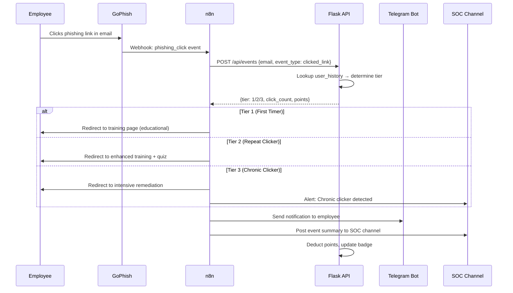
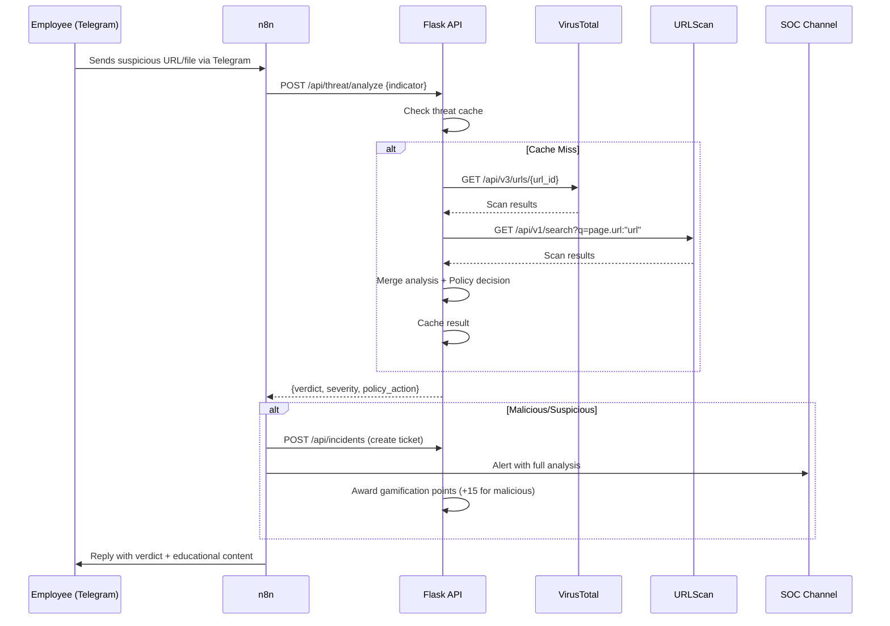

# Afferent Platform — Codebase Documentation & Developer Handoff

> **Version:** 1.0 · **Last Updated:** August 2026  
> **Repository:** `Llovind/Human_Firewall` · **Branch:** `main`

---

## Table of Contents

1. [Executive Summary](#1-executive-summary)
2. [Architecture Overview](#2-architecture-overview)
3. [Tech Stack](#3-tech-stack)
4. [Service Layer Breakdown](#4-service-layer-breakdown)
   - 4.1 [Orchestration Layer — n8n](#41-orchestration-layer--n8n)
   - 4.2 [Simulation Layer — GoPhish](#42-simulation-layer--gophish)
   - 4.3 [Analytics & API Layer — Flask](#43-analytics--api-layer--flask)
   - 4.4 [Presentation Layer — Next.js Dashboard](#44-presentation-layer--nextjs-dashboard)
5. [Directory Structure](#5-directory-structure)
6. [Data Model (SQLite)](#6-data-model-sqlite)
7. [Authentication & Authorization](#7-authentication--authorization)
8. [API Contract Reference](#8-api-contract-reference)
   - 8.1 [Flask Backend Endpoints](#81-flask-backend-endpoints)
   - 8.2 [Next.js API Proxy Routes](#82-nextjs-api-proxy-routes)
9. [Core Workflows (Flow A & Flow B)](#9-core-workflows-flow-a--flow-b)
10. [AI Behavioral Engine](#10-ai-behavioral-engine)
11. [Adaptive Policy Decision Engine](#11-adaptive-policy-decision-engine)
12. [Gamification System](#12-gamification-system)
13. [GRC Compliance Readiness](#13-grc-compliance-readiness)
14. [Telegram Bot Integration](#14-telegram-bot-integration)
15. [Environment Variables](#15-environment-variables)
16. [Deployment & Operations](#16-deployment--operations)
17. [Known Gotchas & Troubleshooting](#17-known-gotchas--troubleshooting)

---

## 1. Executive Summary

**Afferent** (codename `Human_Firewall`) is an adaptive cybersecurity awareness platform that treats **human behavior as a measurable, trainable security perimeter**. Instead of relying solely on static training modules, Afferent creates a closed-loop system where:

1. **Phishing simulations** (GoPhish) expose employee vulnerabilities
2. **Real-time threat intelligence** (VirusTotal + URLScan) validates reported URLs/files
3. **AI behavioral analysis** (multi-LLM with failover) classifies employee risk in real-time
4. **An Adaptive Policy Decision Engine** adjusts access decisions based on a 2D matrix of `Threat Severity × Employee Vulnerability Tier`
5. **Gamification** (points, badges, streaks, daily quizzes) drives long-term behavior change

The platform is designed for a **Proof-of-Concept / capstone demo** environment, running entirely via Docker Compose on a single host.

---

## 2. Architecture Overview

```
┌──────────────────────────────────────────────────────────────────────┐
│                          INTERNET / USER                            │
│                                                                      │
│  Telegram Bot ◄──────┐       Browser ◄──────────┐                   │
│                       │                          │                   │
│               ┌───────▼────────┐      ┌──────────▼──────────┐       │
│               │    n8n (5678)  │      │  Next.js (3000)     │       │
│               │  Orchestrator  │      │  Dashboard (SSR)    │       │
│               │  Flow A + B    │      │  Admin + Employee   │       │
│               └───────┬────────┘      └──────────┬──────────┘       │
│                       │   REST API                │  Proxy via      │
│                       │   webhooks                │  fetchFlaskBackend│
│               ┌───────▼───────────────────────────▼──────────┐      │
│               │           Flask API (5000)                    │      │
│               │  Auth · Events · Incidents · AI · Gamification│      │
│               │  Threat Intel · Policy Engine · GoPhish Client│      │
│               └───────┬──────────────────────────────────────┘      │
│                       │                                              │
│               ┌───────▼────────┐      ┌──────────────────────┐      │
│               │  SQLite (file) │      │   GoPhish (3333/8080)│      │
│               │  human_firewall│      │   Phishing Sim Engine│      │
│               │  .db           │      │                      │      │
│               └────────────────┘      └──────────────────────┘      │
│                                                                      │
│           External APIs: VirusTotal · URLScan · OpenRouter ·         │
│                          Gemini · Groq · Firecrawl                   │
└──────────────────────────────────────────────────────────────────────┘
```

### Key Architectural Decisions

| Decision | Rationale |
|----------|-----------|
| **n8n never touches SQLite directly** | All DB operations go through Flask. n8n calls Flask REST endpoints. Single source of truth. |
| **Next.js dashboard has no business logic** | Purely presentational. All data comes from Flask via `fetchFlaskBackend()` proxy. |
| **Bot-first authentication** | Employees authenticate via Telegram → OTP → Magic Link. No traditional username/password for employees. |
| **SQLite (not Postgres)** | Deliberate choice for POC simplicity. Single-file database, zero config. Flask is the only writer. |
| **Multi-LLM failover** | OpenRouter → Gemini Native → Groq. Never depends on a single provider. |

---

## 3. Tech Stack

| Layer | Technology | Version | Purpose |
|-------|-----------|---------|---------|
| **Orchestration** | n8n (self-hosted) | Latest Docker | Workflow automation, webhook routing, Telegram ↔ Flask glue |
| **Simulation** | GoPhish (custom build) | Latest | Phishing campaign engine, landing pages, credential capture |
| **Backend API** | Python / Flask | 3.x / 3.0+ | REST API, business logic, SQLite access, AI orchestration |
| **Frontend** | Next.js (App Router) | 14+ | SSR dashboard, admin panel, employee personal dashboard |
| **Database** | SQLite | 3.x | Single-file relational store |
| **AI** | OpenRouter / Gemini / Groq | Multi-model | Behavioral classification, org reports, agentic investigation |
| **Threat Intel** | VirusTotal API v3, URLScan.io | - | URL/file scanning and verdict |
| **Bot** | Telegram Bot API | - | Employee interaction, OTP, notifications, SOC alerts |
| **Infra** | Docker Compose | v2 | Single-host container orchestration |
| **Tunneling** | Cloudflare Tunnel / Pinggy | - | Expose local n8n webhooks to Telegram |

---

## 4. Service Layer Breakdown

### 4.1 Orchestration Layer — n8n

**Container:** `hfl-n8n` · **Port:** `5678` · **Data:** `n8n_data` volume

n8n runs two primary workflow files:

#### Flow A — Phishing Simulation Pipeline (`n8n-workflows/flow-a.json`)
```
GoPhish Event → n8n Webhook (flask-event) → Flask /api/events → 
  Tier Classification (1st/2nd/3rd clicker) → Training Page Delivery →
  Telegram Notification to Employee → SOC Channel Alert
```

**Purpose:** When an employee clicks a simulated phishing link, GoPhish fires a webhook to n8n, which orchestrates the entire response: logging the event, determining the employee's risk tier, serving the appropriate training page, and sending Telegram alerts.

#### Flow B — Real-World Threat Reporting Pipeline (`n8n-workflows/flow-b.json`)
```
Employee Reports URL/File (Telegram) → n8n Webhook → 
  VirusTotal Scan → URLScan Analysis → 
  Flask /api/threat/analyze → Verdict Determination →
  Incident Ticket Creation → SOC Alert → 
  Gamification Points Award → Employee Feedback
```

**Purpose:** When an employee submits a suspicious URL or file through the Telegram bot, n8n orchestrates the full threat intelligence pipeline: scanning via VT/URLScan, creating an incident ticket, notifying SOC, and awarding gamification points.

**Critical n8n Configuration:**
- `N8N_BLOCK_ENV_ACCESS_IN_NODE=false` — Required so Flow B can read `VT_API_KEY` and `URLSCAN_API_KEY` from env vars inside Code/Function nodes
- `WEBHOOK_URL` — Must point to the publicly accessible tunnel URL (Cloudflare/Pinggy) so Telegram can reach n8n webhooks
- Webhook path for Telegram: `/webhook/d7e352ba-9e3b-45f1-92cd-dee3d8bc1565/webhook`

---

### 4.2 Simulation Layer — GoPhish

**Container:** `hfl-gophish` · **Ports:** `3333` (Admin HTTPS), `8080` (Phishing Server HTTP)

GoPhish provides the phishing simulation engine. Key concepts:

| GoPhish Entity | Purpose |
|---------------|---------|
| **Templates** | Email templates with `{{.FirstName}}`, `{{.URL}}` placeholders |
| **Landing Pages** | Fake login pages that capture credentials |
| **Sending Profiles** | SMTP configurations for sending simulation emails |
| **Groups** | Target employee lists synced from Flask DB |
| **Campaigns** | Orchestrated runs combining template + page + profile + group |

**Integration with Flask:**
- `backend/gophish_client.py` — Python client wrapping GoPhish REST API
- Flask can list/create/launch campaigns, sync employee groups, import site templates
- GoPhish admin panel uses self-signed TLS cert (browser warning is expected)
- `config.json` is volume-mounted to control DB path and server settings

---

### 4.3 Analytics & API Layer — Flask

**Container:** `hfl-flask` · **Port:** `5000` · **Data:** `flask_db` volume (`/app/instance/`)

Flask is the **single point of truth** for all business logic. It:
- Owns the SQLite database (only writer)
- Exposes REST endpoints for n8n, Next.js, and Telegram
- Runs the AI behavioral engine (LLM calls)
- Executes the Adaptive Policy Decision Engine
- Manages gamification (points, badges, streaks)
- Interfaces with GoPhish API
- Caches threat intelligence results

**Entry point:** `backend/app.py`

**Blueprint registration order:**
```python
app.register_blueprint(auth_bp)           # /admin/login, /api/auth/admin, /api/telegram/command
app.register_blueprint(events_bp)         # /redirect-handler, /api/events, /api/user/*, OTP
app.register_blueprint(incidents_bp)      # /api/incidents (CRUD)
app.register_blueprint(admin_api_bp)      # /api/admin/* (dashboard summary, GoPhish, compliance)
app.register_blueprint(gamification_bp)   # /api/reports, /api/employee/*/reports-summary, /api/quiz/*
app.register_blueprint(threat_bp)         # /api/threat/analyze
app.register_blueprint(proxy_bp)          # /visit, /go, /blocked (Adaptive Gateway)
app.register_blueprint(ai_bp)            # /api/ai/* (classify, analyze, report, agentic)
```

---

### 4.4 Presentation Layer — Next.js Dashboard

**Container:** `hfl-dashboard` · **Port:** `3000`

The dashboard is a **pure presentation layer** with zero business logic. All data is fetched from Flask via the `fetchFlaskBackend()` helper.

#### Pages

| Route | File | Purpose |
|-------|------|---------|
| `/` | `page.tsx` | **Employee Personal Dashboard** — Behavior score, activity log, Spot the Fake game, Daily Quiz, streak tracker |
| `/admin` | `admin/page.tsx` | **SOC Admin Dashboard** — Multi-tab admin panel with Overview, AI Intelligence, GoPhish Campaigns, Leaderboard, etc. |
| `/admin/login` | `admin/login/page.tsx` | Admin password login |
| `/auth` | `auth/page.tsx` | Employee Telegram magic-link authentication |
| `/blocked` | `blocked/page.tsx` | Adaptive Gateway block page (shown when proxy intercepts a threat) |

#### Admin Dashboard Tabs (Components)

| Component | Tab | Description |
|-----------|-----|-------------|
| `OverviewSection` | Overview | KPI cards, trend charts, risk distribution |
| `AIIntelligenceSection` | AI Intelligence | LLM-powered behavioral analysis, agentic investigation, PDF export |
| `GophishCampaignSection` | GoPhish Campaigns | Campaign launch, monitoring, AI template generation |
| `LeaderboardSection` | Leaderboard | Employee rankings by points |
| `EmployeeRosterSection` | Employee Roster | Employee management, enable/disable |
| `PolicySection` | Policy | Adaptive policy rules, 2D decision matrix |
| `ThreatCacheSection` | Threat Cache | Cached threat intelligence entries |
| `ComplianceReadinessSection` | Compliance | ISO 27001 / UU PDP readiness scores |
| `IncidentTriageSection` | Incident Triage | SOC incident ticket management |
| `LoginHistorySection` | Login History | Admin/user authentication audit log |
| `MockWebmailSection` | Mock Webmail | Simulated employee inboxes for OTP delivery |

#### Data Flow Pattern

```
React Component → Next.js API Route (/api/admin/*) → fetchFlaskBackend() → Flask API → SQLite
                                                                                     ↑
                                                                              SERVICE_API_KEY
                                                                              (Bearer token)
```

The `fetchFlaskBackend()` function (`dashboard/src/lib/backendClient.ts`) implements resilient multi-URL fallback:
1. `http://flask_api:5000` (Docker internal DNS)
2. `API_URL` env var
3. `http://hfl-flask:5000` (container name)
4. `NEXT_PUBLIC_API_URL` env var
5. `http://127.0.0.1:5000`, `http://localhost:5000` (fallback)

Each request automatically includes the `SERVICE_API_KEY` as `Authorization: Bearer` header.

---

## 5. Directory Structure

```
Human_Firewall/
├── .env                          # Runtime secrets (gitignored in prod)
├── .env.example                  # Template for environment variables
├── .gitignore
├── docker-compose.yml            # All 4 services defined here
├── CODEBASE_DOCUMENTATION.md     # This file
│
├── backend/                      # Flask API (Python)
│   ├── app.py                    # Entry point, blueprint registration, auth guard
│   ├── database.py               # SQLite schema, migrations, all DB operations (3100+ lines)
│   ├── ai_router.py              # Multi-LLM failover: OpenRouter → Gemini → Groq
│   ├── ai_analysis.py            # Data aggregator for behavioral AI context
│   ├── ai_prompts.py             # System/user prompts for each AI endpoint
│   ├── ai_cache.py               # SQLite-backed LLM response cache (1hr TTL)
│   ├── ai_anonymizer.py          # PII redaction for LLM prompts
│   ├── ai_telegram.py            # AI-enriched Telegram message formatting
│   ├── policy.py                 # 2D Adaptive Policy Decision Engine
│   ├── incident.py               # Incident ticket creation + n8n forwarding
│   ├── integrations.py           # VirusTotal + URLScan API clients + merge logic
│   ├── gophish_client.py         # GoPhish REST API wrapper
│   ├── gamification_routes.py    # Gamification blueprint (/api/reports, /api/quiz/*)
│   ├── seed_data.py              # Dev seed script for demo data
│   ├── badges.json               # Badge tier configuration (SSoT)
│   ├── requirements.txt          # Python dependencies
│   ├── Dockerfile                # Flask container build
│   ├── routes/
│   │   ├── auth.py               # Admin login, Telegram command handler, OTP
│   │   ├── events.py             # Simulation event logging, redirect-handler, user profiles
│   │   ├── incidents.py          # Incident CRUD
│   │   ├── admin_api.py          # Admin dashboard data, GoPhish CRUD, compliance
│   │   ├── ai_routes.py          # AI behavioral endpoints + agentic investigation
│   │   ├── threat.py             # /api/threat/analyze
│   │   └── proxy.py              # Adaptive Gateway proxy (/visit, /go, /blocked)
│   ├── services/
│   │   └── threat_service.py     # Threat analysis orchestrator (VT + URLScan + cache + policy)
│   └── templates/                # Jinja2 HTML templates (training pages, visit, blocked)
│
├── dashboard/                    # Next.js Frontend (TypeScript)
│   ├── src/
│   │   ├── app/
│   │   │   ├── page.tsx          # Employee personal dashboard (1400+ lines)
│   │   │   ├── dashboard.css     # Employee dashboard styles
│   │   │   ├── globals.css       # Global design tokens & styles
│   │   │   ├── layout.tsx        # Root layout with AuthProvider
│   │   │   ├── admin/
│   │   │   │   ├── page.tsx      # Admin SOC dashboard
│   │   │   │   └── login/        # Admin login page
│   │   │   ├── auth/             # Employee Telegram auth
│   │   │   ├── blocked/          # Adaptive Gateway block page
│   │   │   └── api/              # Next.js API proxy routes
│   │   │       ├── admin/        # Proxy to Flask /api/admin/*
│   │   │       ├── ai/           # Proxy to Flask /api/ai/*
│   │   │       ├── auth/         # Proxy to Flask /api/auth/*
│   │   │       ├── behavior/     # Proxy to Flask behavior data
│   │   │       ├── event/        # Proxy to Flask events
│   │   │       ├── incident/     # Proxy to Flask incidents
│   │   │       ├── quiz/         # Proxy to Flask quiz
│   │   │       └── ...
│   │   ├── components/
│   │   │   ├── admin/            # Admin dashboard section components
│   │   │   ├── AnimatedLogo.tsx  # Animated shield logo
│   │   │   ├── Logo.tsx          # Static logo
│   │   │   ├── ReportingBadgesWidget.tsx  # Gamification badges display
│   │   │   ├── SidebarNav.tsx    # Navigation sidebar
│   │   │   └── ThemeToggle.tsx   # Dark/light theme toggle
│   │   ├── context/
│   │   │   └── AuthContext.tsx   # React auth provider (localStorage-backed)
│   │   ├── hooks/
│   │   │   └── usePolling.ts     # Polling hook for live data refresh
│   │   └── lib/
│   │       ├── backendClient.ts  # Flask backend fetch helper with failover
│   │       ├── adminSession.ts   # Admin session management
│   │       ├── store.ts          # In-memory data store for real-time dashboard data
│   │       ├── seed.ts           # Frontend seed data
│   │       └── ExecutivePdfExporter.tsx  # PDF report generation (jspdf)
│   └── Dockerfile
│
├── gophish/                      # GoPhish custom build
│   ├── Dockerfile
│   └── config.json               # GoPhish server configuration
│
├── n8n-workflows/                # n8n workflow JSON exports
│   ├── flow-a.json               # Flow A: Phishing simulation pipeline
│   └── flow-b.json               # Flow B: Real-world threat reporting pipeline
│
├── sync_webhook.py               # Telegram webhook sync utility
├── sync_webhook.ps1              # PowerShell version
├── start_webhook.py              # Combined webhook setup + polling fallback
└── start_webhook.bat             # Windows batch launcher
```

---

## 6. Data Model (SQLite)

Database file: `backend/instance/human_firewall.db`

All schema management is in `database.py:init_db()`. Migrations are idempotent (`CREATE TABLE IF NOT EXISTS`, `ALTER TABLE ADD COLUMN` with try/except).

### Core Tables

#### `user_history` — Employee Profile & Aggregate Stats
```sql
id                     INTEGER PRIMARY KEY AUTOINCREMENT
email                  TEXT NOT NULL UNIQUE        -- Employee email (primary identifier)
divisi                 TEXT NOT NULL               -- Department/division name
click_count            INTEGER DEFAULT 0           -- Total phishing clicks
viewed_training_count  INTEGER DEFAULT 0           -- Completed trainings
skipped_training_count INTEGER DEFAULT 0           -- Skipped trainings
last_clicked           TIMESTAMP                   -- Last phishing click time
telegram_chat_id       TEXT                        -- Linked Telegram account
points                 INTEGER DEFAULT 100         -- Gamification points (starts at 100)
badge                  TEXT DEFAULT 'Guardian'      -- Current badge tier
reports_count_malicious INTEGER DEFAULT 0          -- Confirmed malicious reports
reports_count_total    INTEGER DEFAULT 0           -- Total reports submitted
daily_streak           INTEGER DEFAULT 0           -- Consecutive quiz completion days
last_quiz_completed_at DATE                        -- Last daily quiz completion
quiz_revives_remaining INTEGER DEFAULT 3           -- Monthly streak revive tokens
quiz_revives_month     TEXT DEFAULT '2026-07'       -- Month tracker for revive reset
streak_before_break    INTEGER DEFAULT 0           -- Streak before last break
is_active              INTEGER DEFAULT 1           -- Soft delete / disable flag
updated_at             TIMESTAMP
```

#### `events` — Raw Event Log
```sql
id           INTEGER PRIMARY KEY AUTOINCREMENT
email        TEXT NOT NULL
divisi       TEXT
event_type   TEXT NOT NULL   -- clicked_link, submitted_data, viewed_training,
                             -- skipped_training, phishing_click, spot_the_fake_correct,
                             -- spot_the_fake_incorrect, report_malicious, report_safe,
                             -- daily_quiz_completed
tier_assigned TEXT           -- tier_1 / tier_2 / tier_3 (for simulation events)
campaign_id  TEXT
created_at   TIMESTAMP
```

#### `incidents` — SOC Incident Tickets
```sql
ticket_id        TEXT PRIMARY KEY               -- Format: INC-XXXXXXXX
source_type      TEXT NOT NULL                  -- 'simulation' | 'real_world_report'
reported_url     TEXT
divisi           TEXT
severity         TEXT DEFAULT 'low'             -- 'low' | 'medium' | 'high'
vt_verdict       TEXT                           -- VirusTotal verdict
urlscan_verdict  TEXT                           -- URLScan verdict
screenshot_url   TEXT
checklist        TEXT
file_hash        TEXT                           -- For file-based reports (Flow B)
original_filename TEXT
status           TEXT DEFAULT 'open'            -- 'open' | 'closed'
created_at       TIMESTAMP
closed_at        TIMESTAMP
```

#### `threat_reports` — Gamification Threat Reports
```sql
id                       INTEGER PRIMARY KEY AUTOINCREMENT
report_id                TEXT NOT NULL UNIQUE
email                    TEXT NOT NULL           -- FK → user_history.email
telegram_user_id         TEXT
type                     TEXT NOT NULL           -- 'url' | 'file'
target                   TEXT NOT NULL           -- The URL or file hash reported
verdict                  TEXT NOT NULL           -- 'clean' | 'suspicious' | 'malicious'
severity_tier            TEXT
source_engine            TEXT NOT NULL           -- 'virustotal', 'urlscan', etc.
raw_scores               TEXT                    -- JSON blob of raw scoring data
counted_for_gamification INTEGER DEFAULT 0       -- Whether points were awarded
dedupe_status            TEXT DEFAULT 'new'      -- Deduplication tracking
submitted_at             TIMESTAMP
created_at               TIMESTAMP
```

#### `daily_events` — Quiz & Daily Activity Tracking
```sql
id         INTEGER PRIMARY KEY AUTOINCREMENT
email      TEXT NOT NULL
event_type TEXT NOT NULL
event_date DATE NOT NULL
created_at TIMESTAMP
UNIQUE(email, event_type, event_date)           -- Prevents double-counting
```

#### `readiness_thresholds` — GRC Compliance Configuration
```sql
clause_id         TEXT PRIMARY KEY              -- e.g., 'ISO_A63', 'UU_PDP_35'
clause_number     TEXT NOT NULL                 -- e.g., 'ISO 27001:2022 Annex A.6.3'
clause_title      TEXT NOT NULL
target_value      REAL                          -- Admin-configurable threshold
unit              TEXT NOT NULL                 -- 'percent', 'hours', 'score'
is_legally_mandated INTEGER DEFAULT 0           -- 1 = cannot be changed (e.g., UU PDP 72h)
rationale         TEXT NOT NULL
updated_at        TIMESTAMP
```

#### Supporting Tables

| Table | Purpose |
|-------|---------|
| `registration_otp` | Telegram OTP codes (email, chat_id, otp_code, created_at) |
| `inbox_emails` | Mock webmail inbox for OTP delivery simulation |
| `link_tokens` | Short-lived Telegram deep-link auth tokens (TTL-based) |
| `dashboard_tokens` | Long-lived (30-day) employee dashboard access tokens |

---

## 7. Authentication & Authorization

The platform has **three distinct auth mechanisms** for different user types:

### 7.1 Admin Authentication
- **Method:** Password-based via `POST /api/auth/admin`
- **Password:** Set via `ADMIN_PASSWORD` env var
- **Session:** Stored in Next.js `localStorage` as admin session
- **Guard:** Flask `before_request` hook checks `Authorization: Bearer <SERVICE_API_KEY>` or `session['is_admin']`

### 7.2 Employee Authentication (Bot-First Magic Link)
```
1. Employee opens Telegram bot → types their email
2. Flask generates 6-digit OTP → stores in registration_otp table
3. OTP "sent" to Mock Webmail inbox (inbox_emails table)
4. Employee types OTP in Telegram → Flask verifies → links chat_id to email
5. Employee types /dashboard → Flask generates dashboard_token (30-day TTL)
6. Link opens Next.js /auth?token=<token>&email=<email>
7. Next.js validates token via Flask → stores user in AuthContext (localStorage)
```

### 7.3 Service-to-Service Authentication
- **Method:** `Authorization: Bearer <SERVICE_API_KEY>` header
- **Used by:** Next.js API routes → Flask, n8n → Flask
- **Key:** Set via `SERVICE_API_KEY` env var (shared secret)

### Auth Guard Logic (`app.py:require_admin_for_protected_routes`)
```python
1. DEV_BYPASS_AUTH=true → skip all auth (dev mode)
2. Check if endpoint is in PUBLIC_ROUTES → skip auth
3. Check Bearer token against SERVICE_API_KEY → allow
4. Check session['is_admin'] → allow
5. Otherwise → 401 JSON or 302 redirect
```

### RBAC Roles (Dashboard)
| Role | Access |
|------|--------|
| `admin` | Full access to all tabs |
| `soc` | Incidents, Threats, AI Intelligence |
| `grc` | Compliance Readiness, Policy |
| `ciso` | All tabs (read-only perspective) |
| `phishing_admin` | GoPhish Campaigns, Employee Roster |

---

## 8. API Contract Reference

### 8.1 Flask Backend Endpoints

#### Authentication
| Method | Path | Auth | Description |
|--------|------|------|-------------|
| `POST` | `/api/auth/admin` | Public | Admin login (password check) |
| `POST` | `/api/telegram/command` | Public | Telegram bot command handler |
| `GET` | `/api/auth/validate-token` | Public | Validate dashboard token |

#### Events & User Profile
| Method | Path | Auth | Description |
|--------|------|------|-------------|
| `GET` | `/redirect-handler?email=&rid=` | Public | GoPhish click handler, serves training |
| `POST` | `/api/events` | Public | Log behavioral event |
| `GET` | `/api/user/<email>/history` | Public | User event history |
| `GET` | `/api/user/<email>/profile` | Public | User profile summary |
| `POST` | `/api/otp/create` | Public | Generate OTP for email |
| `POST` | `/api/otp/verify` | Public | Verify OTP and link Telegram |
| `GET` | `/api/user-eligibility?email=` | Public | Check if user can take quiz |
| `GET` | `/api/user-activity?email=` | Public | Get recent user activities |

#### Incidents
| Method | Path | Auth | Description |
|--------|------|------|-------------|
| `POST` | `/api/incidents` | Service Key | Create incident ticket |
| `GET` | `/api/incidents?source_type=&status=` | Service Key | List incidents |
| `PATCH` | `/api/incidents/<ticket_id>` | Service Key | Update incident status |

#### Admin Dashboard
| Method | Path | Auth | Description |
|--------|------|------|-------------|
| `GET` | `/api/dashboard-summary` | Service Key | Overview KPIs and stats |
| `GET` | `/api/leaderboard` | Service Key | Employee rankings |
| `GET` | `/api/login-history` | Service Key | Auth audit log |
| `GET` | `/api/compliance-summary` | Service Key + GRC/CISO role | GRC readiness scores |
| `GET` | `/api/admin/readiness-thresholds` | Service Key + GRC/CISO role | Threshold configuration |
| `POST` | `/api/admin/readiness-thresholds` | Service Key + GRC/CISO role | Update threshold |

#### GoPhish Management
| Method | Path | Auth | Description |
|--------|------|------|-------------|
| `GET` | `/api/admin/gophish/campaigns` | Service Key | List all campaigns |
| `GET` | `/api/admin/gophish/resources` | Service Key | List templates, pages, profiles |
| `POST` | `/api/admin/gophish/sync` | Service Key | Sync employee group to GoPhish |
| `POST` | `/api/admin/gophish/launch` | Service Key | Launch new campaign |
| `GET` | `/api/admin/gophish/campaigns/<id>/complete` | Service Key | Complete/stop campaign |
| `POST` | `/api/admin/gophish/templates` | Service Key | Create email template |
| `POST` | `/api/admin/gophish/pages` | Service Key | Create landing page |

#### Threat Intelligence
| Method | Path | Auth | Description |
|--------|------|------|-------------|
| `POST` | `/api/threat/analyze` | Service Key | Analyze URL/file indicator |
| `GET` | `/api/admin/threats/feed` | Service Key | Threat cache feed for dashboard |
| `POST` | `/api/admin/threats/action` | Service Key | SOC action on threat |

#### AI Behavioral Engine
| Method | Path | Auth | Description |
|--------|------|------|-------------|
| `GET` | `/api/ai/classify-all` | Public | Batch classify all employees |
| `GET` | `/api/ai/user/<email>` | Public | Deep analysis of one user |
| `GET` | `/api/ai/report?days=` | Public | Generate organizational narrative report |
| `POST` | `/api/ai/cache/invalidate` | Public | Clear all AI cache |
| `GET` | `/api/ai/cache/stats` | Public | Cache debugging stats |
| `GET` | `/api/ai/router/status` | Public | LLM provider configuration |
| `POST` | `/api/ai/gophish/generate` | Public | AI-generate phishing template |
| `POST` | `/api/ai/agentic/investigate` | Public | Agentic multi-step investigation |
| `GET` | `/api/ai/agentic/history` | Public | Past agentic investigation results |

#### Gamification
| Method | Path | Auth | Description |
|--------|------|------|-------------|
| `POST` | `/api/reports` | Service Key | Create threat report (from n8n) |
| `GET` | `/api/employee/<email>/reports-summary` | Dashboard Token | Employee gamification summary |
| `POST` | `/api/quiz/complete` | Dashboard Token | Submit daily quiz completion |
| `GET` | `/api/quiz/today?email=` | Public | Get today's quiz question |
| `POST` | `/api/quiz/revive` | Dashboard Token | Use streak revive token |

#### Adaptive Gateway (Proxy Simulation)
| Method | Path | Auth | Description |
|--------|------|------|-------------|
| `GET` | `/visit` | Public | URL submission form |
| `GET/POST` | `/go?url=` | Public | Analyze and proxy/block URL |
| `GET` | `/blocked?url=` | Public | Block page with threat details |

#### Policy Engine
| Method | Path | Auth | Description |
|--------|------|------|-------------|
| `POST` | `/api/admin/policy/evaluate` | Service Key | Evaluate policy for threat+user |

---

### 8.2 Next.js API Proxy Routes

All Next.js API routes live in `dashboard/src/app/api/` and proxy to Flask via `fetchFlaskBackend()`. They follow a consistent pattern:

```typescript
// Example: /api/admin/threats/feed/route.ts
import { fetchFlaskBackend } from '@/lib/backendClient';

export async function GET(request: NextRequest) {
  const res = await fetchFlaskBackend('/api/admin/threats/feed' + queryString);
  const data = await res.json();
  return NextResponse.json(data);
}
```

| Next.js Route | Proxies To |
|---------------|-----------|
| `/api/admin/compliance-summary` | `/api/compliance-summary` |
| `/api/admin/employees` | `/api/admin/employees` |
| `/api/admin/gophish/*` | `/api/admin/gophish/*` |
| `/api/admin/leaderboard` | `/api/leaderboard` |
| `/api/admin/threats/feed` | `/api/admin/threats/feed` |
| `/api/admin/threats/action` | `/api/admin/threats/action` |
| `/api/admin/policy/evaluate` | `/api/admin/policy/evaluate` |
| `/api/ai/*` | `/api/ai/*` |
| `/api/auth/*` | `/api/auth/*` |
| `/api/behavior` | `/api/user/<email>/profile` + computation |
| `/api/event` | `/api/events` |
| `/api/incident` | `/api/incidents` |
| `/api/quiz/*` | `/api/quiz/*` |

---

## 9. Core Workflows (Flow A & Flow B)

### Flow A — Phishing Simulation (Click → Train → Score)



### Flow B — Real-World Threat Reporting (Report → Scan → Score)



---

## 10. AI Behavioral Engine

### Architecture

```
ai_routes.py (endpoints) → ai_analysis.py (data aggregation) → ai_prompts.py (prompt engineering)
                                                                          ↓
                                                                   ai_router.py (LLM failover)
                                                                          ↓
                                                               OpenRouter → Gemini → Groq
                                                                          ↓
                                                                   ai_cache.py (SQLite cache, 1hr TTL)
```

### LLM Failover Chain (`ai_router.py`)

```
1. OpenRouter (primary) — tries multiple free models in sequence:
   - openrouter/free
   - google/gemma-4-31b-it:free
   - google/gemma-4-26b-a4b-it:free
   - nvidia/nemotron-3-nano-30b-a3b:free
   - cohere/north-mini-code:free
   - openai/gpt-oss-20b:free

2. Google Gemini Native (fallback 1) — Gemini Flash free tier

3. Groq (fallback 2) — Llama 3.3 70B free tier

Exponential backoff: 1s → 2s → 4s between provider switches
```

### AI Capabilities

| Endpoint | Capability | Cache TTL |
|----------|-----------|-----------|
| `classify-all` | Batch risk classification of all employees | 1 hour |
| `user/<email>` | Deep behavioral analysis + personalized training recommendations | 1 hour |
| `report` | Organizational security posture narrative report (Markdown + PDF export) | 1 hour |
| `gophish/generate` | AI-generated phishing email templates customized to target org | None |
| `agentic/investigate` | Multi-step autonomous investigation with tool calling | None |

### Agentic Investigation

The agentic investigation endpoint (`/api/ai/agentic/investigate`) implements a **tool-calling agent loop**. The AI can autonomously call these tools:

| Tool | Description |
|------|-------------|
| `get_user_behavior_history` | Fetch full behavioral profile for a user |
| `get_threat_reports` | Retrieve threat reports submitted by a user |
| `get_recent_events` | Get recent event log entries |
| `get_division_stats` | Aggregate stats per division |
| `get_incident_history` | Fetch incident tickets |

The agent iterates up to 5 rounds of tool calling before producing a final investigation report.

---

## 11. Adaptive Policy Decision Engine

**File:** `backend/policy.py`

The policy engine uses a **2D Adaptive Decision Matrix** with two axes:
- **X-axis:** Threat Score (0–100, derived from VT/URLScan)
- **Y-axis:** Employee Vulnerability Tier (Guardian / Sentinel / Champion / Vulnerable)

### Decision Matrix

| Threat Score | Vulnerable | Guardian | Sentinel/Champion |
|:---:|:---:|:---:|:---:|
| **0–39** | ⚠️ WARN | ✅ ALLOW & AUDIT | ✅ ALLOW & AUDIT |
| **40–49** | ⚠️ WARN | ⚠️ WARN & MANDATE | ⚠️ WARN |
| **50–74** | 🔴 BLOCK | ⚠️ WARN & MANDATE | ⚠️ WARN |
| **75–100** | 🔴 BLOCK | 🔴 BLOCK | 🔴 BLOCK |

### Actions

| Action | Effect |
|--------|--------|
| `ALLOW` | Request passes through, audit log recorded |
| `WARNING` | User shown interstitial warning, must acknowledge to proceed |
| `BLOCK` | Request blocked, user redirected to `/blocked` page with threat details |
| `NOTIFY_SOC` | SOC team alerted via Telegram channel |

---

## 12. Gamification System

### Points System

| Action | Points | Condition |
|--------|--------|-----------|
| Phishing click | **-20** | Per simulation click |
| Skip training | **-5** | Per skipped training |
| Complete training | **+10** | Per training module |
| Report malicious URL/file | **+15** | Confirmed malicious by VT/URLScan |
| Report safe URL/file | **+2** | Clean report (still rewards vigilance) |
| Daily Quiz correct | **+10** | Per day (with streak multiplier) |
| Spot the Fake correct | **+5** | Per correct identification |
| Spot the Fake incorrect | **-3** | Per incorrect identification |

### Badge Tiers (from `badges.json`)

| Badge | Threshold | Description |
|-------|-----------|-------------|
| `sentinel_troops` | 1 report | Entry-level defender |
| `front_line_defender` | 3 reports | Active reporter |
| `the_front_man` | 5 reports | Consistent threat hunter |
| `cyber_shield_elite` | 10 reports | Top-tier security champion |

### Daily Streak System

- Employees complete a daily cybersecurity quiz to maintain their streak
- Streak breaks if a day is missed (resets to 0)
- **Revive Tokens:** 3 per month, can restore a broken streak
- Streak displayed prominently on employee dashboard with flame icon

### Anti-Gaming / Deduplication

- `threat_reports.dedupe_status` tracks if the same URL/file was already reported
- `daily_events` has `UNIQUE(email, event_type, event_date)` constraint
- Points for reports only awarded once per unique target

---

## 13. GRC Compliance Readiness

### Mapped Regulatory Frameworks

| Clause ID | Framework | Clause | Metric |
|-----------|-----------|--------|--------|
| `ISO_A63` | ISO 27001:2022 Annex A.6.3 | Security awareness & training | % employees above training threshold |
| `ISO_A68` | ISO 27001:2022 Annex A.6.8 | Security event reporting | Report-to-click resilience ratio |
| `ISO_A812` | ISO 27001:2022 Annex A.8.12 | Data leakage prevention | Admin-defined |
| `UU_PDP_35` | UU PDP Pasal 35 | Internal security obligations | Organization assessment score |
| `UU_PDP_46` | UU PDP Pasal 46 | 72-hour breach notification | Fixed at 72 hours (legally mandated) |

### Readiness Score Calculation

Readiness scores are computed from live platform data:
- **Training completion rate** → ISO A.6.3 score
- **Report-to-click ratio** (reports / phishing clicks) → ISO A.6.8 score
- Admin-configurable thresholds per clause
- `is_legally_mandated = 1` clauses cannot have their thresholds changed (e.g., UU PDP 72-hour deadline)

---

## 14. Telegram Bot Integration

### Bot: `@HFL_Notif_Bot`

**Token source:** `TELEGRAM_BOT_TOKEN` env var

### Command Handler (`routes/auth.py:telegram_command`)

The bot command handler processes these inputs:

| User Input | Action |
|------------|--------|
| `email@domain.com` | Generate OTP, send to Mock Webmail |
| 6-digit number | Verify OTP, link Telegram to email |
| `/start` | Welcome message with instructions |
| `/help` | Command reference |
| `/profile` | Show personal stats (points, badge, streak) |
| `/dashboard` | Generate magic-link to web dashboard |

### Webhook Setup

**Sync Script:** `sync_webhook.py` / `sync_webhook.ps1`

The webhook sync process:
1. Read tunnel URL from `.env` (`WEBHOOK_URL`)
2. Verify n8n is running on `localhost:5678`
3. Construct full webhook URL: `<WEBHOOK_URL>/webhook/d7e352ba-9e3b-45f1-92cd-dee3d8bc1565/webhook`
4. Call Telegram `setWebhook` API
5. Verify with `getWebhookInfo`

### SOC Alerting

SOC alerts are sent to a Telegram group/channel identified by `SOC_CHAT_ID`. Alerts include:
- Phishing click events (with employee details)
- Confirmed malicious threat reports
- Incident ticket creation summaries

---

## 15. Environment Variables

Copy `.env.example` to `.env` and fill in values:

```bash
# 1. Flask Core & Auth
SECRET_KEY=                    # Flask session encryption key
ADMIN_PASSWORD=                # SOC admin login password
SERVICE_API_KEY=               # Internal service-to-service auth key
DEV_BYPASS_AUTH=false           # Set 'true' to skip all auth (dev only!)
FLASK_DEBUG=false

# 2. AI Multi-LLM Failover Chain
OPENROUTER_API_KEY=            # Primary LLM provider
OPENROUTER_MODEL=inclusionai/ling-3.0-flash:free
GEMINI_API_KEY=                # Fallback 1
GROQ_API_KEY=                  # Fallback 2
FIRECRAWL_API_KEY=             # Web scraping for AI template generation

# 3. Infrastructure & CORS
ALLOWED_ORIGINS=http://localhost:3000,http://localhost:5000

# 4. GoPhish
GOPHISH_API_KEY=               # From GoPhish admin panel
GOPHISH_API_URL=https://gophish:3333

# 5. Telegram Bot
BOT_USERNAME=HFL_Notif_Bot
TELEGRAM_BOT_TOKEN=            # From @BotFather
SOC_CHAT_ID=                   # Telegram group/channel for SOC alerts

# 6. n8n & Webhooks
WEBHOOK_URL=                   # Public tunnel URL (Cloudflare/Pinggy)

# 7. Threat Intelligence
VT_API_KEY=                    # VirusTotal API key
URLSCAN_API_KEY=               # URLScan.io API key

# 8. Next.js Frontend
NEXT_PUBLIC_BASE_URL=http://localhost:3000
NEXT_PUBLIC_API_URL=http://localhost:5000
NEXT_PUBLIC_BOT_USERNAME=HFL_Notif_Bot
```

---

## 16. Deployment & Operations

### Quick Start

```bash
# 1. Clone and configure
git clone https://github.com/Llovind/Human_Firewall.git
cd Human_Firewall
cp .env.example .env
# Fill in all API keys in .env

# 2. Build and start all services
docker compose up --build -d

# 3. Verify health
curl http://localhost:5000/health    # Flask: {"status": "ok"}
curl http://localhost:5678/healthz   # n8n: {"status": "ok"}
# GoPhish: https://localhost:3333 (accept self-signed cert)
# Dashboard: http://localhost:3000

# 4. Import n8n workflows
# Open http://localhost:5678 → Import flow-a.json and flow-b.json

# 5. Set up Telegram webhook
python sync_webhook.py
```

### Service Ports

| Service | Internal Port | External Port | Protocol |
|---------|:---:|:---:|----------|
| n8n | 5678 | 5678 | HTTP |
| GoPhish Admin | 3333 | 3333 | HTTPS (self-signed) |
| GoPhish Phishing | 80 | 8080 | HTTP |
| Flask API | 5000 | 5000 | HTTP |
| Next.js Dashboard | 3000 | 3000 | HTTP |

### Docker Volumes

| Volume | Mount | Purpose |
|--------|-------|---------|
| `n8n_data` | `/home/node/.n8n` | n8n workflows, credentials, SQLite |
| `gophish_data` | `/opt/gophish/database` | GoPhish campaign data |
| `flask_db` | `/app/instance` | Flask SQLite database |

### Container Network

All services share the `hfl_network` bridge network. Internal DNS hostnames:
- `flask_api` → Flask container
- `n8n` → n8n container  
- `gophish` → GoPhish container
- `dashboard` → Next.js container

---

## 17. Known Gotchas & Troubleshooting

### n8n SQLite Lock Issues

**Problem:** `SQLITE_READONLY` after copying SQLite files into n8n container.

**Solution:**
1. Stop the n8n container
2. Delete WAL/SHM journal files: `database.sqlite-wal`, `database.sqlite-shm`
3. Run checkpoint: `PRAGMA journal_mode = DELETE; PRAGMA integrity_check;`
4. Fix ownership: `chown 1000:1000 database.sqlite` (n8n runs as `node:node`, UID 1000)
5. Restart container

### Telegram 401 Unauthorized

**Problem:** `Get TG File Path` node throws 401 after bot token changes.

**Solution:** Bot token is embedded in n8n workflow JSON **and** in the n8n SQLite database. You must update:
1. `n8n-workflows/flow-b.json` — search/replace old token in HTTP request URLs
2. n8n SQLite `workflow_entity` table — update all workflow rows containing the old token
3. Restart n8n container

### GoPhish HTTPS Certificate Warning

**Expected behavior.** GoPhish admin panel uses a self-signed certificate. Click "Advanced → Proceed" in your browser.

### CORS Issues

If the dashboard can't reach Flask, check:
1. `ALLOWED_ORIGINS` in `.env` includes the dashboard URL
2. For Cloudflare tunnels, add the tunnel URL to `ALLOWED_ORIGINS`

### AI Cache Stale Data

AI classification results are cached for 1 hour. To force refresh:
- Add `?refresh=true` query param to any `/api/ai/*` endpoint
- Or call `POST /api/ai/cache/invalidate` to clear all AI cache

### GoPhish API Key

After first GoPhish login, the initial admin password is printed in container logs:
```bash
docker logs hfl-gophish 2>&1 | grep "admin"
```
Get the API key from GoPhish admin panel → Settings → API Key.

### Webhook URL Rotation

When your tunnel URL changes (Cloudflare/Pinggy):
1. Update `WEBHOOK_URL` in `.env`
2. Run `python sync_webhook.py` to re-register with Telegram
3. Restart n8n: `docker compose restart n8n`
4. Update `ALLOWED_ORIGINS` if needed

---

> **End of documentation.** For questions, reach out to the development team or check the existing docs in the repository root (`Handoff.MD`, `Handoff_Addendum.MD`, `DEVELOPER_GUIDE.md`).
