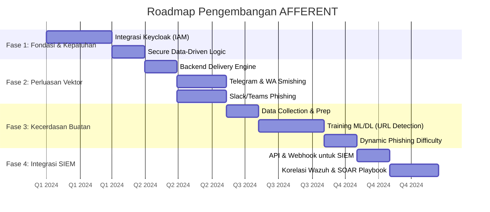
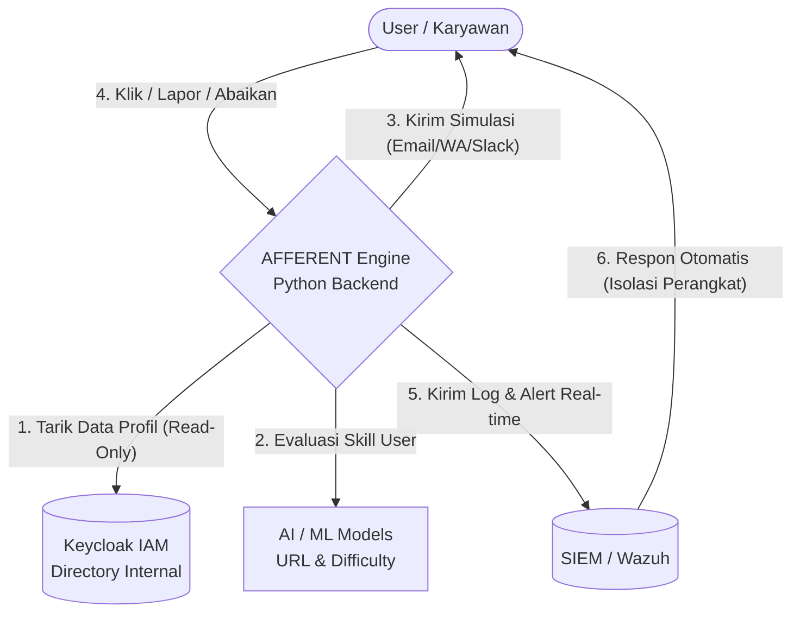
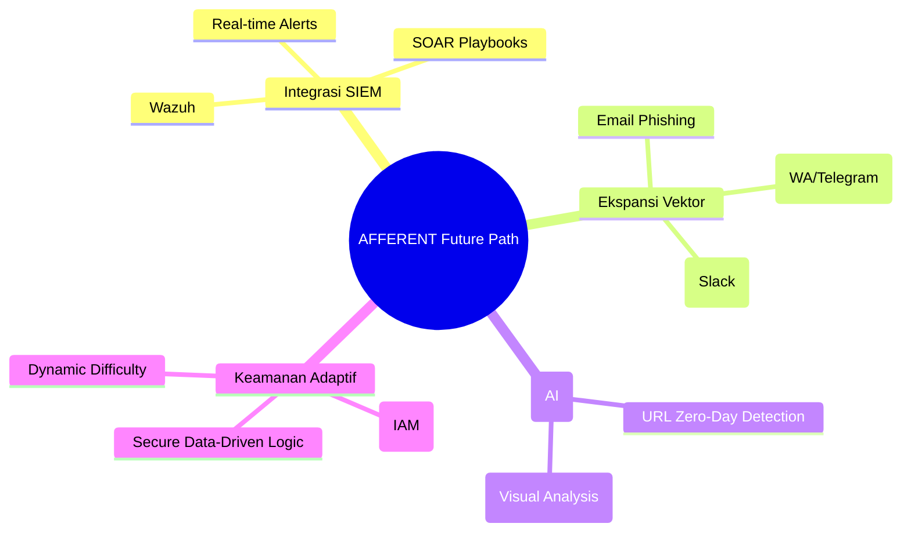
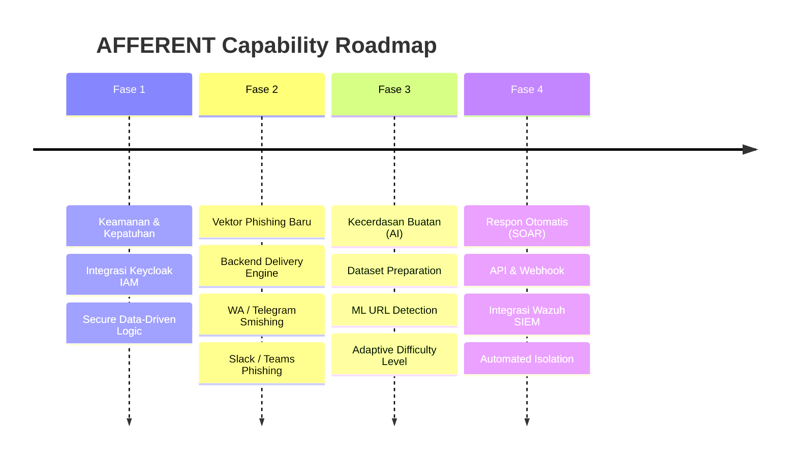
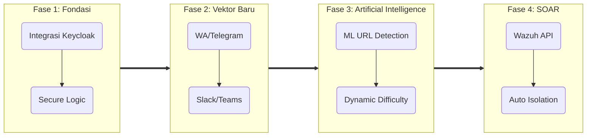
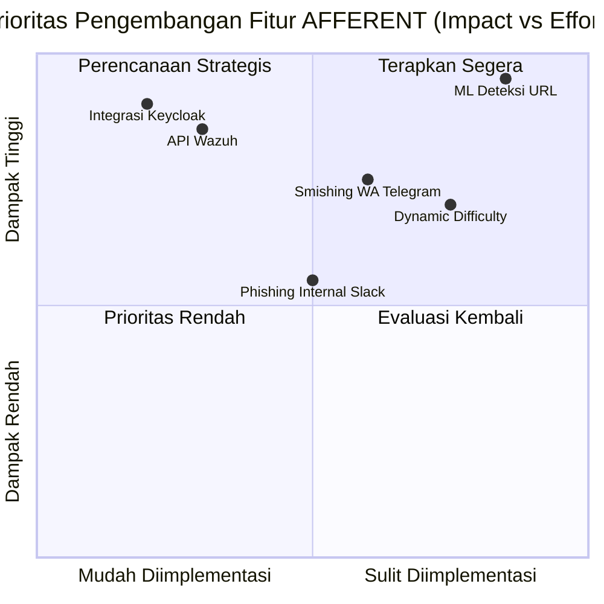

# Peta Jalan Pengembangan (Future Path) AFFERENT

Dokumen ini merangkum peta jalan pengembangan platform *Human Firewall* AFFERENT, dirancang khusus untuk memenuhi standar keamanan industri (ISO 27001) dan kepatuhan privasi data (UU PDP), dengan memanfaatkan ekosistem *Open Source*.

---

## 1. Integrasi SIEM (Security Information and Event Management)
**Konsep Dasar:**
AFFERENT tidak berdiri sendiri. Platform ini harus bisa memberikan peringatan dini ke sistem pusat keamanan jaringan perusahaan (seperti Wazuh).

**Elaborasi & Implementasi Teknis:**
*   **Pemantauan Terpusat (Hybrid Routing):** Data akan dikirim melalui dua jalur. Jalur *Real-time* (menggunakan API) khusus untuk laporan ancaman kritis (misal: user melaporkan URL bahaya), sehingga tim SOC (Security Operations Center) bisa langsung merespons. Jalur *Interval/Batch* digunakan untuk mengirim data perilaku harian guna menghemat beban server.
*   **Otomatisasi Respon:** Memungkinkan eksekusi skenario pertahanan otomatis (SOAR). Jika *user* mengklik tautan *phishing* berbahaya, SIEM (Wazuh) dapat otomatis memberikan peringatan atau mengisolasi perangkat *user* tersebut.

## 2. Ekspansi Vektor Pengiriman (Starting Points)
**Konsep Dasar:**
Penipuan tidak hanya terjadi via email. AFFERENT akan memperluas simulasi ke *platform* komunikasi instan (*chat*) yang sering digunakan di lingkungan kerja.

**Elaborasi & Implementasi Teknis:**
*   **Smishing (Telegram/WhatsApp):** Mengirimkan simulasi serangan via pesan singkat (seolah-olah dari kurir atau promo) ke nomor WA atau Telegram *user*. Secara teknis, ini dapat diwujudkan dengan membangun *Delivery Engine* kustom di *backend* Python yang terhubung ke Telegram Bot API.
*   **Corporate Chat Phishing (Slack/Teams):** Simulasi pesan langsung (DM) dari "IT Support" palsu di dalam ruang komunikasi internal perusahaan.
*   **Pelacakan Terpusat:** Menggunakan *trackable links* unik (mirip mekanisme GoPhish) yang disisipkan ke dalam pesan *chat*, sehingga analitik klik dari semua *platform* tetap terekam di satu *dashboard* sentral AFFERENT.

## 3. Deteksi URL Cerdas berbasis AI (ML/DL Model)
**Konsep Dasar:**
Meninggalkan metode pemblokiran tradisional yang hanya mengandalkan daftar hitam (*blacklist*), beralih ke deteksi ancaman prediktif yang lebih cerdas.

**Elaborasi & Implementasi Teknis:**
*   **Deteksi Zero-Day Phishing:** Melatih model *Machine Learning* untuk menganalisis pola URL (seperti *typosquatting* misal `g00gle.com`, panjang URL, dan entropi karakter) untuk mendeteksi *phishing* baru yang belum masuk *database* keamanan global.
*   **Analisis Visual (Deep Learning):** Menggunakan model Visi Komputer (*Computer Vision*) untuk me-*render* dan menganalisis tampilan halaman web. Jika sebuah halaman terlihat persis seperti halaman login Microsoft namun memiliki URL aneh, AI akan menandainya secara otomatis.

## 4. Simulasi Phishing Adaptif & Aman (Secure Internal Data-Driven)
**Konsep Dasar:**
Menciptakan *template phishing* yang sangat personal dan meyakinkan (*Spear-Phishing*) dengan membawa nama atasan atau departemen *user*, namun tetap **100% mematuhi UU Pelindungan Data Pribadi (UU PDP)** dan terhindar dari risiko kebocoran data.

**Elaborasi & Implementasi Teknis:**
*   **Integrasi Open-Source IAM (Keycloak):** AFFERENT tidak akan melakukan *scraping* data publik (OSINT) yang berisiko melanggar privasi. Sebagai gantinya, AFFERENT akan terintegrasi dengan **Keycloak** (sistem *Identity and Access Management open-source* yang merepresentasikan *Active Directory* internal perusahaan).
*   **Prinsip Akses Minimal (Read-Only & JIT):** AFFERENT hanya diberikan akses API secara *Read-Only* ke Keycloak. Saat AI AFFERENT ingin membuat email jebakan untuk seorang target, sistem hanya akan memanggil (*query*) data jabatannya secara *Just-in-Time*, tanpa harus menyalin dan menyimpan seluruh *database* karyawan. Hal ini memastikan tidak ada data rahasia perusahaan (seperti *password*) yang bocor jika AFFERENT diretas.
*   **Penyesuaian Kesulitan (Dynamic Difficulty):** Berdasarkan hasil tes sebelumnya, AI akan menaikkan atau menurunkan tingkat kesulitan *phishing*. Jika *user* selalu lolos simulasi dasar, mereka akan menerima serangan *Spear-Phishing* tingkat lanjut yang konteksnya diambil secara aman dari Keycloak.

---

## Roadmap Pengembangan (Milestone)

Berikut adalah visualisasi tahapan implementasi dari rencana di atas (dibagi berdasarkan fase prioritas teknis):



---

## Arsitektur Sistem & Alur Integrasi (Flowchart)

Grafik ini menggambarkan bagaimana AFFERENT berinteraksi dengan komponen eksternal (Keycloak, SIEM, dan *User*) dalam ekosistem perusahaan yang aman. Ini sangat cocok untuk melengkapi Bab Arsitektur di buku Tugas Akhir Anda:



---

## Pemetaan Fitur Utama (Mindmap)

Grafik ini merangkum 4 pilar utama pengembangan AFFERENT ke depannya secara visual, sangat pas untuk disajikan di bagian presentasi atau poster Tugas Akhir:



---

## Roadmap Pitch Deck (Format Timeline Tanpa Tanggal)

Format Timeline ini sangat profesional, bersih, dan elegan untuk disajikan di *Pitch Deck* (Presentasi ke Investor/Dosen). Format ini menunjukkan perkembangan fase (*Milestone*) tanpa terjebak komitmen tanggal yang spesifik:



---

## Maturity Model / Capability Pipeline (Flowchart Horizontal)

Jika Anda ingin menunjukkan "Pipa Nilai" (*Value Pipeline*) atau bagaimana kapabilitas sistem AFFERENT bertambah matang dari waktu ke waktu di *slide* presentasi, diagram aliran horizontal ini sangat cocok. Bentuknya menyerupai panah progres yang sangat umum digunakan dalam dokumen bisnis/strategis:



---

## Matriks Prioritas Fitur (Quadrant Chart)

Grafik ini sangat ampuh untuk meyakinkan investor atau dosen penguji mengenai **"Mengapa fitur A dikerjakan lebih dulu dibanding fitur B?"**. Matriks ini memetakan setiap inisiatif berdasarkan *Impact* (Dampak ke Bisnis/Keamanan) berbanding *Effort* (Tingkat Kesulitan Teknis). Sangat direkomendasikan untuk *Pitch Deck*:



---

## Evolusi Ekosistem Platform (State Diagram)

Jika Anda ingin menggambarkan bahwa AFFERENT bukanlah sekadar sekumpulan fitur yang terpisah, melainkan sebuah ekosistem yang terus berevolusi (di mana *output* dari fase sebelumnya menjadi bahan bakar untuk fase berikutnya), diagram status ini memberikan kesan arsitektur sistem yang saling berkesinambungan:

```mermaid
stateDiagram-v2
    direction LR
    [*] --> Fase1_Fondasi
    Fase1_Fondasi --> Fase2_VektorBaru : Identitas Sentral Berjalan
    Fase2_VektorBaru --> Fase3_Kecerdasan : Kumpulan Dataset Memadai
    Fase3_Kecerdasan --> Fase4_Otomasi : Insight Ancaman Akurat
    
    state Fase1_Fondasi {
      Keycloak_IAM
      Secure_Data_Logic
    }
    state Fase2_VektorBaru {
      Smishing_Engine
      Corporate_Chat
    }
    state Fase3_Kecerdasan {
      URL_ML_Model
      Adaptive_Difficulty
    }
    state Fase4_Otomasi {
      Wazuh_Integration
      SOAR_Playbooks
    }
    Fase4_Otomasi --> [*]
```



---

## Visualisasi Milestone (Text-Based Graphics)

Jika Anda membutuhkan opsi non-grafik (bukan berupa *chart* ter-render) yang tetap rapi, elegan, dan menonjolkan tahapan (*milestones*), Anda bisa menggunakan format teks terstruktur di bawah ini. Bentuk ini sangat cocok disalin ke Notion, GitHub README, atau *slide* presentasi yang sangat minimalis:

> 🛡️ **MILESTONE 1: Fondasi Keamanan & Kepatuhan**
> *Membangun basis yang kuat agar platform siap diintegrasikan secara Enterprise.*
> ├── 🔐 Integrasi Keycloak IAM
> └── 📊 Logika Data-Driven yang Aman

> 💬 **MILESTONE 2: Ekspansi Vektor Komunikasi**
> *Bergerak keluar dari kotak masuk Email menuju aplikasi chat karyawan.*
> ├── 🚀 Backend Delivery Engine
> ├── 📱 WhatsApp & Telegram Smishing
> └── 💬 Slack & Teams Corporate Phishing

> 🧠 **MILESTONE 3: Kecerdasan Buatan (AI)**
> *Menjadikan sistem proaktif, bukan reaktif, melalui otomasi tingkat tinggi.*
> ├── 🗃️ Pengumpulan Dataset URL
> ├── 🤖 Training Model ML (Deteksi URL Zero-day)
> └── 🎯 Penyesuaian Tingkat Kesulitan Phishing secara Adaptif

> ⚡ **MILESTONE 4: Respon Otomatis (SOAR)**
> *Menutup celah keamanan dalam hitungan detik secara otomatis.*
> ├── 🔌 API & Webhook Terpusat
> ├── 🛡️ Integrasi Wazuh SIEM
> └── 🔒 Isolasi Perangkat secara Otomatis

---

## Peta Perjalanan Pengguna (User Journey Map)

Grafik ini berfokus pada **Pengalaman Karyawan (End-User)** saat berinteraksi dengan sistem ini dari waktu ke waktu. Sangat menarik untuk presentasi karena menyoroti aspek psikologis (apakah mereka merasa terganggu atau aman) dari sistem *Human Firewall* yang Anda bangun:

```mermaid
journey
    title Evolusi Pengalaman Karyawan (AFFERENT User Journey)
    section Fase 1: Fondasi
      Menerima Email Simulasi Aman: 4: Karyawan
      Melaporkan lewat Portal AFFERENT: 5: Karyawan
    section Fase 2: Omnichannel
      Menerima Jebakan Phishing di WA: 3: Karyawan
      Mendapat Pesan Palsu di Slack: 2: Karyawan
    section Fase 3: Adaptif & Cerdas
      Mendapat Serangan Spesifik/Sulit: 2: Karyawan
      Terlatih Mengenali Pola AI: 5: Karyawan
    section Fase 4: Otomasi
      Akses Terisolasi Otomatis (Jika Gagal): 1: Karyawan
      Lingkungan Kerja Terasa Aman: 5: Karyawan, SOC Team
```

---

## Tabel Roadmap Pengembangan (Summary Table)

Opsi non-grafik ini sangat ideal jika Anda ingin merangkum seluruh perencanaan ke dalam satu halaman laporan tercetak (PDF/Word) dengan format yang sangat terstruktur, rapi, dan mudah dibaca secara cepat (Skimmable):

| Fase | Nama Milestone | Fokus Utama (Deliverables) | Tingkat Dampak | Ketergantungan (Dependency) |
| :--- | :--- | :--- | :---: | :--- |
| **Fase 1** | Fondasi & Kepatuhan | Integrasi Keycloak (IAM) & Logika Data-Driven | Tinggi (Krusial) | - |
| **Fase 2** | Ekspansi Vektor | Delivery Engine, WA/Telegram, Slack/Teams Phishing | Menengah | Fase 1 Selesai |
| **Fase 3** | Kecerdasan Buatan | Dataset URL, Deteksi ML, Tingkat Kesulitan Adaptif | Sangat Tinggi | Fase 2 Selesai |
| **Fase 4** | Respon Otomatis | API Webhook, Integrasi SIEM Wazuh, Isolasi Perangkat | Tinggi | Fase 3 Selesai |
