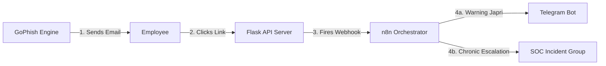
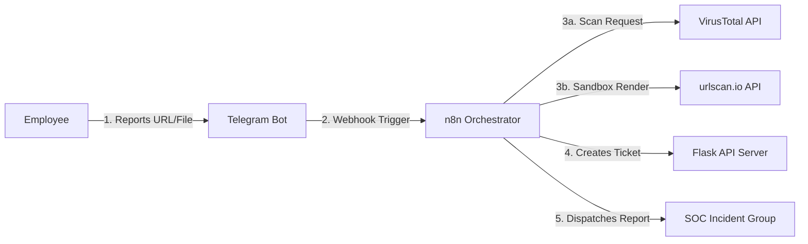

# 🛡️ Human Firewall — Integrated Security Awareness & Threat Response Platform

An enterprise-grade, interactive security awareness and automated threat intelligence platform. This solution orchestrates phishing simulations, delivers real-time educational interventions ("Teachable Moments"), and automates Threat Assessment & SOC Incident Ticketing using **Docker, Python (Flask), SQLite, n8n, and Telegram Bot API**.

---

## 📐 System Architecture & Data Flow

### Flow A — Phishing Simulation Loop
This workflow handles simulated attacks, employee education, and chronic offender tracking:



### Flow B — Threat Reporting & Assessment Loop
This workflow automates the analysis of user-reported URLs/files and creates incident tickets:



---

## ✨ Key Features

### 1. Phishing Simulation (Flow A)
*   **Teachable Moment Landing Page**: Instantly redirects employees who click simulated phishing links to a friendly, informative educational landing page.
*   **Personal Telegram Warnings**: Bot automatically registers and dispatches a direct message warning to the specific employee, ensuring they receive immediate feedback.
*   **SOC Escalation (Chronic Clickers)**: Monitors employee performance. If an employee fails the simulation multiple times, the bot automatically dispatches a priority escalation alert to the SOC team.

### 2. On-Demand Threat Assessment Bot (Flow B)
*   **Self-Service Reporting**: Employees can forward suspicious URLs or document attachments directly to the bot.
*   **Automated Multi-Engine Scan**: Evaluates reports against VirusTotal (static threat intelligence) and urlscan.io (dynamic headless browser behavior).
*   **Incident Ticketing**: Generates a ticket on the Flask SOC Dashboard and broadcasts formatted incident logs (with verdicts, metadata, and link analyses) to the SOC team.

### 3. Automated OTP Onboarding
*   **Self-Service Registration**: Employees initiate registration by sending `/start` to the bot.
*   **Email OTP Verification**: Generates a 6-digit OTP code, saves it to SQLite, and logs it to a local webmail inbox, linking the Telegram Chat ID to the employee's corporate email.

### 4. Integrated Mock Webmail Portal
*   Includes a built-in mock **Webmail Inbox** in the dashboard. This allows for 100% offline testing of OTP emails during presentations without requiring Mailtrap or external SMTP setups.

---

## 🚀 Quick Start Guide

### 1. Prerequisites
Ensure the following tools are installed on your system:
*   [Docker Desktop](https://www.docker.com/products/docker-desktop/)
*   Python 3.10+
*   Git

### 2. Installation & Setup
1.  **Clone and navigate to the project directory**:
    ```bash
    cd C:\Human_Firewall
    ```
2.  **Initialize the Database**:
    Seed the SQLite database with 30 days of mock history to populate dashboard analytics:
    ```bash
    cd backend
    python seed_data.py
    cd ..
    ```
3.  **Spin Up the Services**:
    Launch the containers (Flask, n8n, GoPhish) in the background:
    ```bash
    docker-compose up -d
    ```
4.  **Expose the Webhook Tunnel (Bypass Firewall)**:
    Since the Telegram Bot API requires an HTTPS URL to send webhook events to your local n8n, run the following SSH tunnel command:
    ```bash
    ssh -p 443 -R 0:localhost:5678 qr@a.pinggy.io
    ```
    *Copy the generated HTTPS URL (e.g., `https://xxx.run.pinggy-free.link`).*

5.  **Configure n8n Webhook**:
    *   Open `docker-compose.yml`, locate the `WEBHOOK_URL` environment variable under the `n8n` service, and paste your active Pinggy HTTPS URL.
    *   Apply the update:
        ```bash
        docker-compose up -d
        ```
    *   Open the n8n editor (`http://localhost:5678`), open both **Flow A** and **Flow B**, toggle their status to **Inactive** and back to **Active** (Publish) to register the new webhook URL with the Telegram Bot API.

---

## 🛠️ Developer Guide

### Directory Layout
```text
C:/Human_Firewall/
├── backend/
│   ├── instance/
│   │   └── human_firewall.db  # Local SQLite Database (Excluded from Git)
│   ├── templates/
│   │   └── dashboard.html     # SOC Analytics Dashboard & Webmail Interface
│   ├── app.py                 # Flask API Server & Controllers
│   ├── database.py            # SQLite Schemas & Queries
│   └── seed_data.py           # Database Initializer & Mock Data Seeder
├── n8n-workflows/
│   ├── flow-a.json            # Flow A: Phishing Simulation Workflow
│   └── Flow B ... .json       # Flow B: Threat Assessment & Onboarding
└── docker-compose.yml         # Container Orchestration Configuration
```

### Git Commits & Credential Sanitization
Before committing and pushing any changes to a public repository:
1.  **Sanitize active API credentials**:
    ```bash
    python prepare_git_commit.py
    ```
2.  **Commit and push to GitHub**:
    ```bash
    git add .
    git commit -m "feat: your feature summary"
    git push origin main
    ```
3.  **Restore local active credentials**:
    ```bash
    python restore_git_commit.py
    ```
*(Note: Backup files and local databases are automatically excluded via `.gitignore`).*
