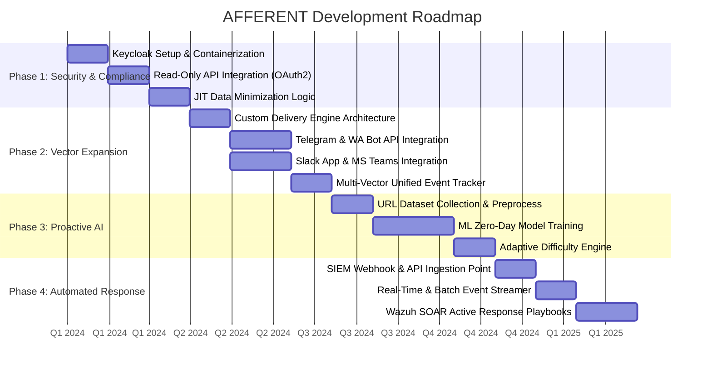
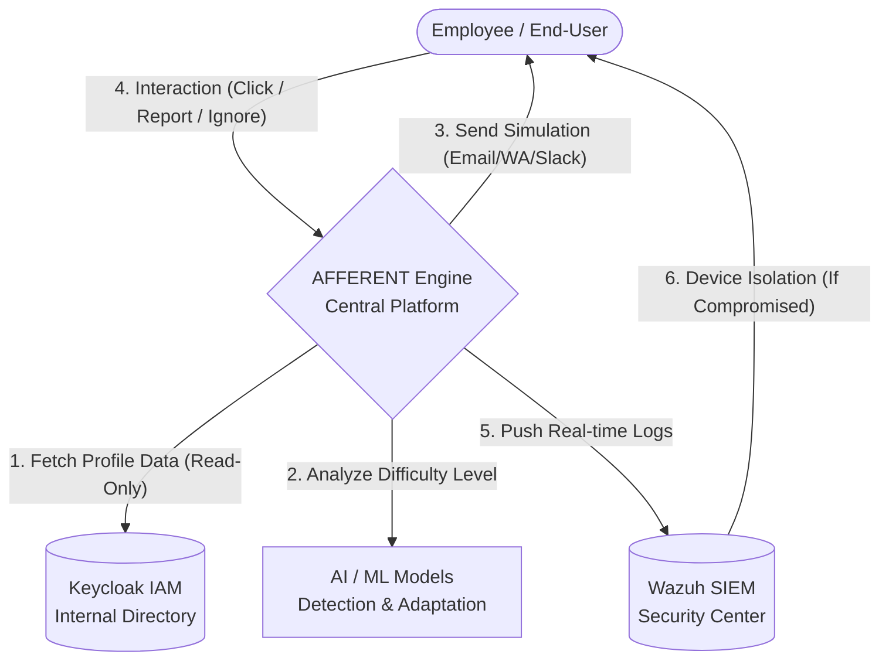

# AFFERENT Strategic Development Roadmap

This document outlines the strategic vision for the development of AFFERENT, a comprehensive Human Firewall platform. This roadmap is designed to evolve AFFERENT into a proactive security ecosystem that complies with **ISO 27001** standards and data privacy regulations (e.g., GDPR / UU PDP).

Development is divided into 4 sequential and interconnected Core Phases:

*   **Phase 1: Security & Compliance (Foundation)** - Establishing a legally compliant and secure internal identity integration.
*   **Phase 2: Vector Expansion (Omnichannel)** - Expanding threat simulations beyond email (WhatsApp, Telegram, Slack).
*   **Phase 3: Proactive Artificial Intelligence** - Implementing Machine Learning for Zero-Day detection and adaptive simulation difficulty.
*   **Phase 4: Automated Response (SOAR & SIEM)** - Integrating AFFERENT with central security systems for instant threat isolation.

Choose the visualization below that best fits your pitch deck, presentation, or documentation needs.

---

## 1. Strategic Execution Timeline (Gantt Chart)

This visualization maps the logical sequence of technical execution. Phase 1 is an absolute prerequisite, ensuring that subsequent AI and automation features operate on valid, secure data.



---

## 2. Integrated System Architecture (Flowchart)

This flowchart illustrates the comprehensive system interaction, from secure profile data retrieval to automated isolation by the SIEM. It is highly effective for presenting the technical workflow to an IT or engineering audience.



---

## 3. Execution Priority Matrix (Quadrant Chart)

This strategic visualization answers a critical management question: *"Why prioritize feature A over feature B?"*. The matrix elegantly contrasts the Security Impact of an initiative against its Technical Effort.

```mermaid
quadrantChart
    title AFFERENT Feature Prioritization (Impact vs Effort)
    x-axis "Low Effort" --> "High Effort"
    y-axis "Low Impact" --> "High Impact"
    quadrant-1 Implement Immediately (Quick Wins)
    quadrant-2 Strategic Projects (Major Initiatives)
    quadrant-3 Low Priority (Fill-ins)
    quadrant-4 Re-evaluate (Time Sinks)
    
    Keycloak IAM Integration: [0.2, 0.9]
    Wazuh SIEM Integration: [0.35, 0.85]
    Zero-Day URL Detection (ML): [0.85, 0.95]
    Adaptive Phishing Difficulty: [0.75, 0.75]
    WhatsApp & Telegram Smishing: [0.6, 0.75]
    Slack & Teams Phishing: [0.55, 0.6]
```

---

## 4. Platform Maturity Evolution (State Diagram)

This diagram reinforces the narrative that AFFERENT is not merely a collection of standalone features, but a growing ecosystem. The output from a preceding phase serves as the vital fuel for the subsequent phase.

```mermaid
stateDiagram-v2
    direction LR
    [*] --> Phase1_Security
    Phase1_Security --> Phase2_Vectors : Centralized Identity Ready
    Phase2_Vectors --> Phase3_AI : Multi-Platform Interactions Logged
    Phase3_AI --> Phase4_SOAR : Mature Threat Insights
    
    state Phase1_Security {
      Keycloak_IAM
      Secure_Data_Logic
    }
    state Phase2_Vectors {
      Smishing_WA_Telegram
      Corporate_Chat_Slack
    }
    state Phase3_AI {
      ML_ZeroDay_Detection
      Adaptive_Difficulty
    }
    state Phase4_SOAR {
      Wazuh_Integration
      Automated_Isolation
    }
    Phase4_SOAR --> [*]
```



---

## 5. Strategic Summary (Summary Table)

This tabular format is highly recommended for printed reports (PDF/Word documents) or dense presentation slides. It presents the entire roadmap concisely, making it highly skimmable for evaluators or investors.

| Phase | Focus Area | Key Deliverables | Impact Level | Prerequisite (Dependency) |
| :--- | :--- | :--- | :---: | :--- |
| **Phase 1** | **Security & Compliance** | Keycloak (IAM) Integration, Secure Data-Driven Logic (Privacy Compliant) | Very High | - |
| **Phase 2** | **Vector Expansion** | Backend Delivery Engine, WhatsApp/Telegram Smishing, Slack/Teams Phishing | Medium | Phase 1 Completed |
| **Phase 3** | **Proactive AI** | URL Dataset Collection, Zero-Day Detection ML Model, Adaptive Phishing Difficulty | Very High | Phase 2 Completed |
| **Phase 4** | **Automated Response** | Centralized API Webhooks, Wazuh SIEM Integration, Automated Device Isolation | High | Phase 3 Completed |

---

## 6. Text-Based Visualizations (Non-Rendered Milestones)

A minimalist alternative guaranteed to render flawlessly without relying on markdown graphic engines. Ideal for copy-pasting into WhatsApp messages, GitHub READMEs, or casual presentation slides.

> 🛡️ **PHASE 1: Security & Compliance**
> *Building a robust authentication foundation compliant with data privacy regulations.*
> ├── 🔐 Keycloak IAM Integration
> └── 📊 Secure Data-Driven Logic

> 💬 **PHASE 2: Vector Expansion (Omnichannel)**
> *Moving beyond the email inbox into modern corporate communication apps.*
> ├── 🚀 Backend Delivery Engine
> ├── 📱 WhatsApp & Telegram Smishing
> └── 💬 Slack & Teams Corporate Phishing

> 🧠 **PHASE 3: Proactive AI**
> *Implementing intelligent automation for threat recognition and test personalization.*
> ├── 🗃️ Extensive URL Dataset Collection
> ├── 🤖 Zero-Day URL Detection (Machine Learning)
> └── 🎯 Adaptive Phishing Difficulty

> ⚡ **PHASE 4: Automated Response (SOAR & SIEM)**
> *Closing security gaps instantly and autonomously without human intervention.*
> ├── 🔌 Centralized API & Webhooks
> ├── 🛡️ Wazuh SIEM Integration
> └── 🔒 Automated Device Isolation
