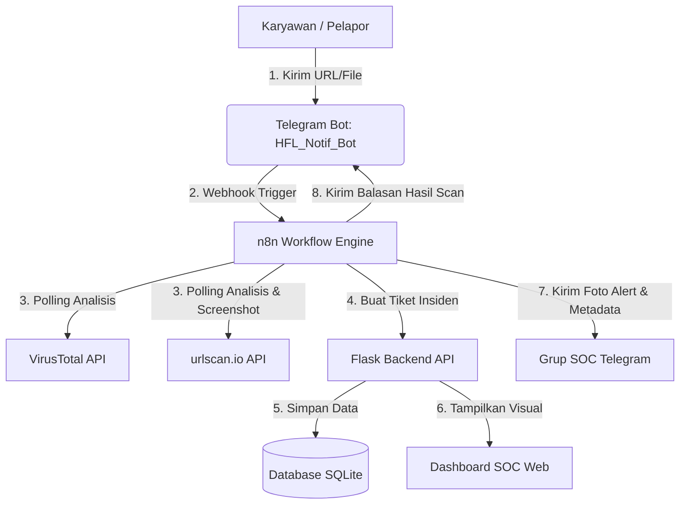

# PANDUAN PENGGUNA: SISTEM HUMAN FIREWALL & DETEKSI ANCAMAN OTOMATIS
### Infranexia — Performance & Support Services (PSS)
**Versi:** 1.0 (Production Ready)  
**Tanggal:** 30 Juni 2026  
**Penulis:** lovind (SOC Developer)  

---

## 1. PENDAHULUAN & ARSITEKTUR SISTEM

Sistem **Human Firewall** adalah platform otomatisasi keamanan siber yang dirancang untuk memperkuat pertahanan lapis pertama Infranexia—yaitu para karyawan. Sistem ini mengintegrasikan komunikasi instan (Telegram), mesin otomatisasi alur kerja (n8n), mesin analisis reputasi (VirusTotal & urlscan.io), serta dashboard pemantauan internal (Flask & SQLite).

Sistem ini terbagi menjadi dua alur kerja utama:
1.  **Flow A — Simulasi Phishing & Eskalasi Kepatuhan**: Digunakan secara internal oleh tim PSS/SOC untuk menguji kewaspadaan karyawan melalui email phishing simulasi, melacak interaksi mereka, serta menghitung skor risiko divisi (*Human Risk Score*).
2.  **Flow B — Pelaporan Ancaman Riil (Real Threat Reporting)**: Digunakan secara aktif oleh karyawan untuk melaporkan URL atau File mencurigakan secara mandiri via Telegram Bot, yang akan dianalisis secara otomatis di latar belakang dalam waktu 1-2 menit.

### Komponen Utama Sistem


---

## 2. PANDUAN UNTUK KARYAWAN (Cara Melaporkan Ancaman)

Karyawan dapat melaporkan indikasi ancaman siber (seperti tautan mencurigakan atau file lampiran asing) secara mandiri melalui Telegram.

### Langkah-Langkah Pelaporan:
1.  Buka aplikasi Telegram dan cari bot resmi: **`@HFL_Notif_Bot`** (atau nama bot yang dikonfigurasi).
2.  Kirimkan pesan berupa:
    *   **Untuk Tautan**: Cukup kirim atau teruskan (*forward*) pesan berisi tautan URL (contoh: `http://testsafebrowsing.appspot.com/s/malware.html`).
    *   **Untuk Dokumen/File**: Lampirkan file yang mencurigakan secara langsung (contoh: file `.exe`, `.pdf`, atau dokumen mencurigakan lainnya).
3.  **Respon Tunggu Otomatis**: Bot akan segera mengirimkan balasan konfirmasi awal:
    > *"🔍 Laporan URL/File Anda telah diterima. Sedang menganalisis menggunakan VirusTotal dan urlscan.io... Mohon tunggu sekitar 1 hingga 2 menit untuk hasil analisis."*
4.  **Respon Hasil Akhir**: Setelah analisis di latar belakang selesai (biasanya dalam 1 menit), bot akan mengirimkan status final:
    *   **Jika Aman**:
        > *"✅ URL/File yang Anda laporkan tampak AMAN. Tidak ditemukan indikasi ancaman berbahaya. Silakan buka/akses dengan aman. 👍"*
    *   **Jika Berbahaya**:
        > *"⚠️ URL/File yang Anda laporkan terdeteksi BERBAHAYA. Severity: HIGH. Tiket insiden telah dibuat dan tim SOC kami sudah diberitahu. Terima kasih! 🙏"*

---

## 3. PANDUAN UNTUK ANALIS SOC (Cara Membaca Dashboard & Alert)

Analis SOC memantau ancaman dan tingkat risiko kepatuhan divisi melalui dashboard web dan grup koordinasi Telegram.

### A. Memantau Dashboard Web SOC
Dashboard dapat diakses secara lokal pada alamat: **`http://localhost:5000`**

1.  **Metrik Human Risk Score per Division (Modul Flow A)**:
    *   Menampilkan skor keamanan masing-masing divisi (skala 0-100).
    *   Setiap divisi dimulai dengan **Baseline 100 poin**.
    *   Poin berkurang jika karyawan di divisi tersebut melakukan kesalahan saat simulasi phishing:
        *   Mengklik link phishing simulasi: **-10 poin**
        *   Mengabaikan/melewati pelatihan wajib (*Skipped Training*): **-5 poin**
        *   Menonton video edukasi sampai selesai: mendapat pemulihan **+2 poin**
2.  **Tabel Active Threat Tickets (Modul Flow B)**:
    *   Menampilkan laporan ancaman riil yang dilaporkan langsung oleh karyawan via bot Telegram.
    *   Kolom **Detail Target** otomatis merender data secara spesifik:
        *   Jika tipe laporan adalah **URL**, kolom akan menampilkan link aktif yang bisa diklik analis untuk investigasi.
        *   Jika tipe laporan adalah **File**, kolom akan menampilkan ikon dokumen 📄 disertai **Nama File Asli** dan potongan **SHA256 Hash** (contoh: `malware_test.exe (851cce55...)`) untuk memudahkan pencarian database atau karantina lokal.

### B. Membaca Alert di Telegram Grup SOC
Setiap kali ada ancaman riil yang terdeteksi dengan status berbahaya (Severity Low/Medium/High), n8n akan mengirimkan alert otomatis ke grup Telegram SOC:
1.  **Screenshot Visual Halaman Web**: Alert dikirim dalam bentuk foto berupa hasil tangkapan layar asli (*screenshot*) dari website yang dilaporkan (ditarik via API urlscan.io). Jika screenshot kosong, bot akan mengirimkan gambar placeholder SOC.
2.  **Informasi Caption Detail**:
    *   `ID Tiket`: ID insiden unik yang tersimpan di database Flask.
    *   `URL / File`: Tautan atau nama file yang dilaporkan.
    *   `Severity`: Tingkat bahaya (CLEAN/LOW/MEDIUM/HIGH).
    *   `VT Verdict`: Deteksi mesin pemindai (contoh: `10/92 engines flagged malicious`).
    *   `Web Details`: Judul halaman web, IP Address hosting, serta teknologi web server yang digunakan (misal: Cloudflare, Nginx).
    *   `Pelapor`: Nama karyawan yang melaporkan ancaman tersebut.

---

## 4. PANDUAN ADMINISTRATOR & PEMECAHAN MASALAH (Troubleshooting)

Bagian ini ditujukan untuk administrator sistem atau tim PSS yang memelihara infrastruktur otomatisasi n8n.

### A. Mengatasi Masalah Loop Stuck (Macet di Node Wait)
*   **Masalah**: Node jeda waktu bawaan n8n (`Wait` node) seringkali mengalami pembekuan (*stuck*) pada server n8n lokal karena kendala penguncian database SQLite saat mencoba menyimpan status eksekusi.
*   **Solusi**: Node `Wait` telah diganti dengan node **`Code`** yang menjalankan instruksi penantian asinkron di memori (RAM) menggunakan JavaScript. 
*   **Implementasi Kode**:
    ```javascript
    await new Promise(resolve => setTimeout(resolve, 10000));
    return $input.item;
    ```
    *Gunakan node Code ini di setiap alur looping polling status untuk memastikan kestabilan 100%.*

### B. Mengatasi Crash Status 404 (urlscan.io Polling)
*   **Masalah**: Selama urlscan.io melakukan pemindaian di cloud, pemanggilan API hasil akan mengembalikan respon HTTP Status **404** (*Scan is not finished yet*). Secara default, n8n menganggap respon non-2xx sebagai kegagalan sistem dan langsung mematikan workflow.
*   **Solusi**: 
    1. Klik dua kali pada node **`urlscan Get URL Result`** (HTTP Request).
    2. Masuk ke bagian paling bawah di tab **Parameters**.
    3. Klik **Add Option** -> pilih **Ignore Response Status** (atau *Never Fail*).
    4. Pastikan toggle opsi tersebut diatur ke posisi **`ON`** (aktif/hijau).
    *Ini memaksa n8n memperlakukan 404 sebagai respon sukses biasa agar loop polling dapat mengecek kembali di putaran berikutnya.*

### C. Mengatasi Masalah n8n Loop Trap
*   **Masalah**: Di n8n, memanggil data node di dalam loop menggunakan sintaks statis seperti `$('Node Name').item.json` akan selalu mengembalikan data dari putaran pertama (yang berisi error 404), bukan data sukses pada iterasi terakhir.
*   **Solusi**: Pada node **`Evaluate URL`** dan **`Evaluate File`**, pastikan baris pertama kode JavaScript membaca data dari input dinamis terbaru menggunakan **`$input.item.json`**:
    ```javascript
    const mergedData = $input.item.json;
    const origInput = $('Parse Input').item.json;
    // ... sisa kode pengolahan metrik ...
    ```

---
*Dokumen ini merupakan bagian dari aset operasional keamanan siber Infranexia.*
